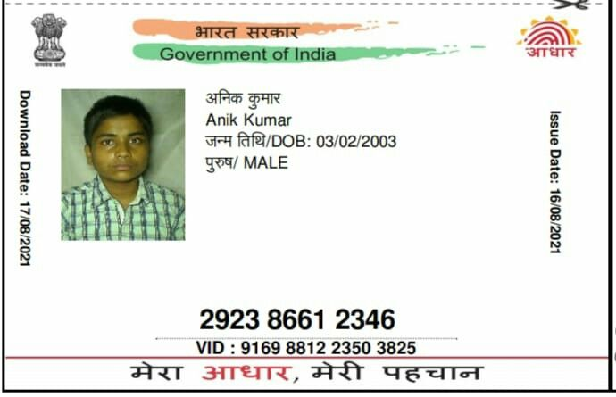
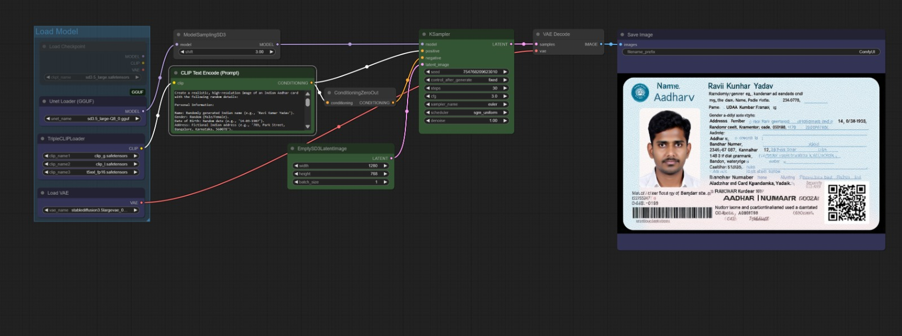
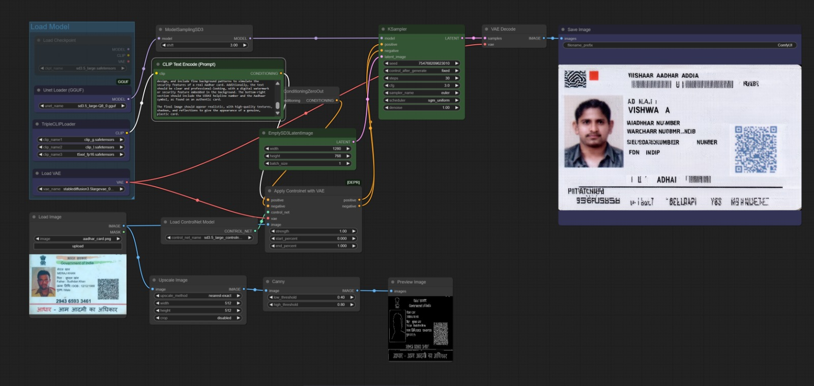
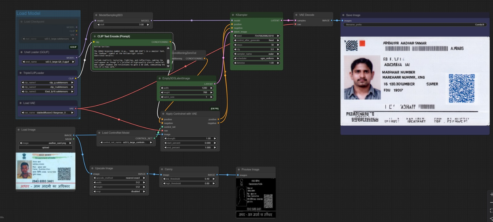
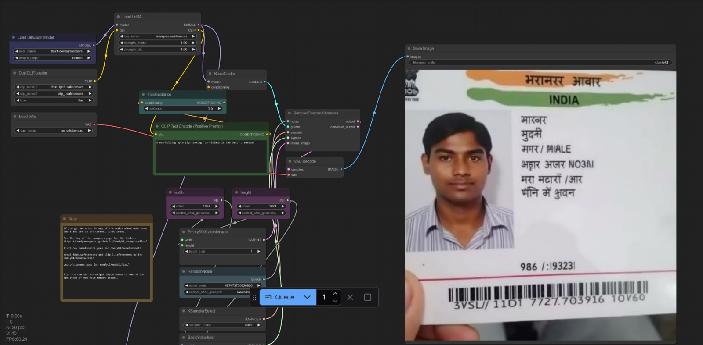
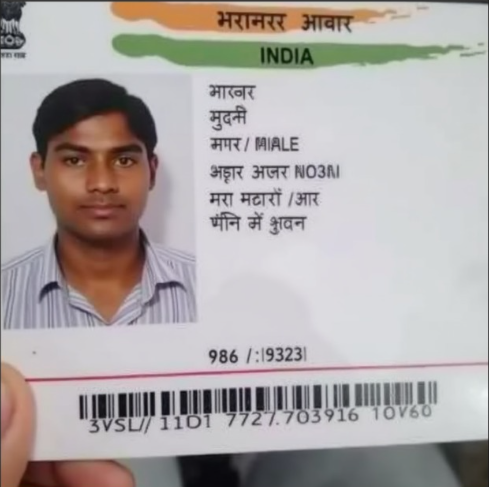
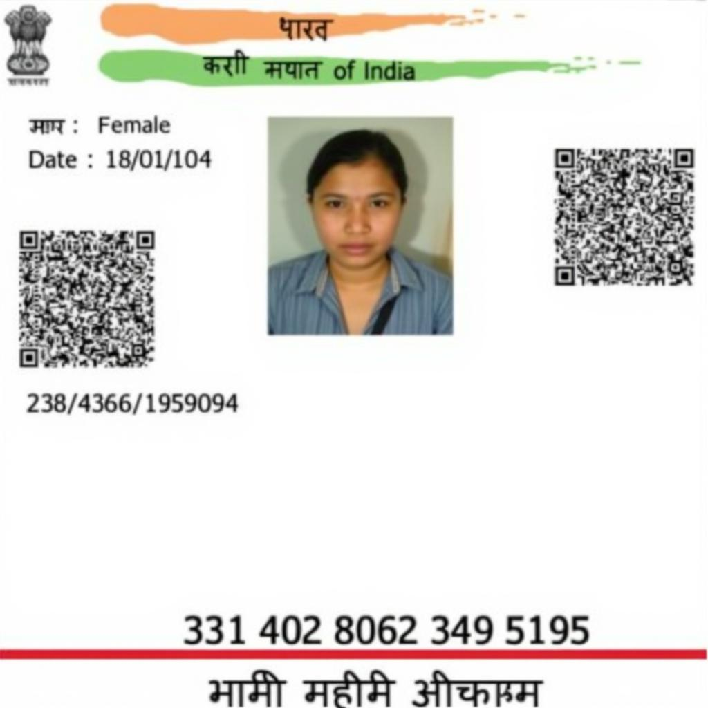
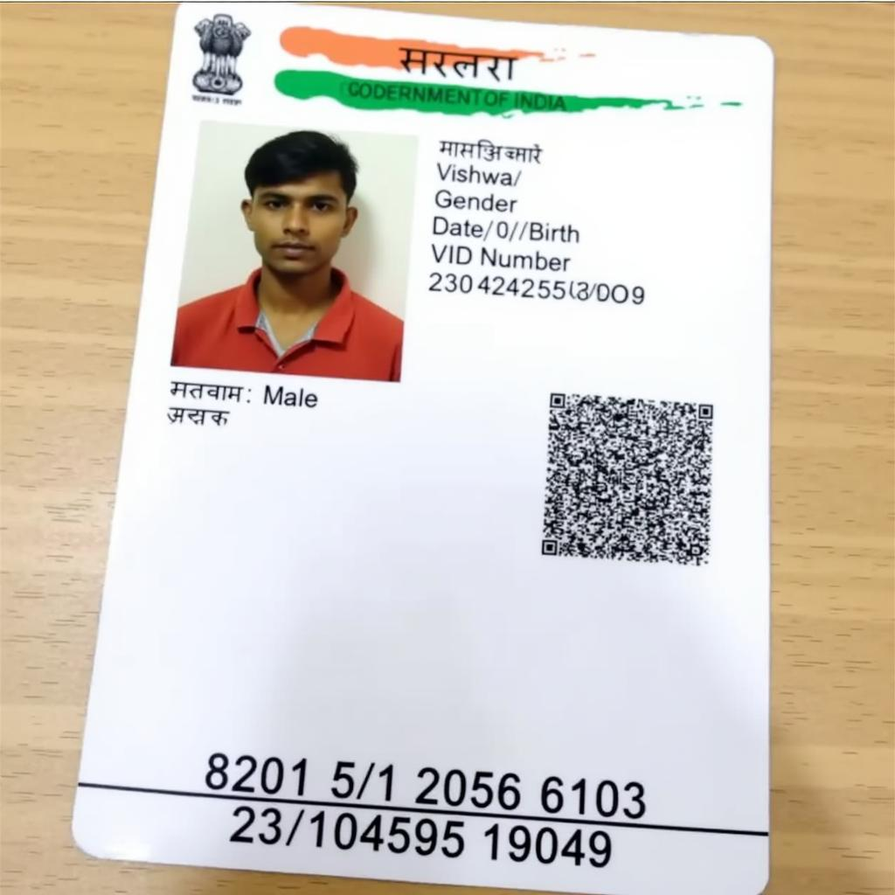
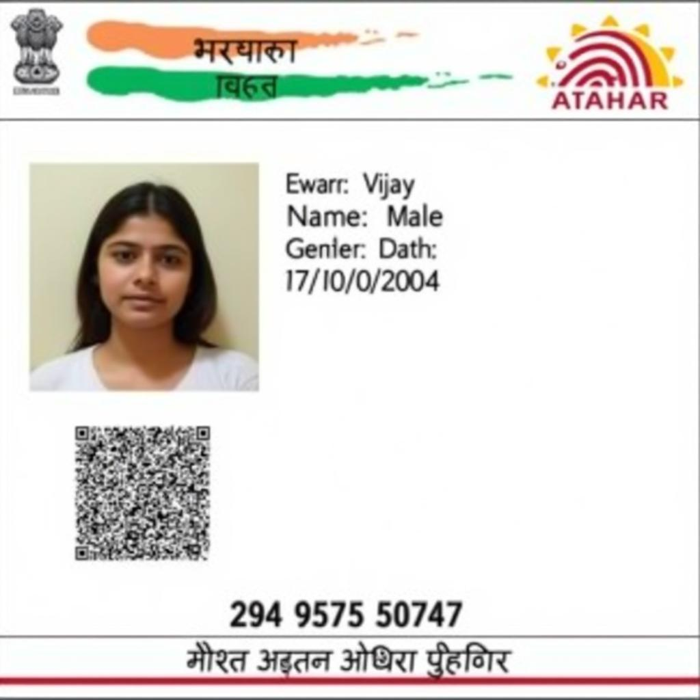

# HyperGen: Synthetic Government ID Generation

## Overview
HyperGen is an advanced tool for generating synthetic Aadhar cards (Indian government ID) using both computer vision techniques and AI-based generative models. This project implements two distinct approaches to ID generation:

1. **CV-based Generation**: Uses OpenCV and EasyOCR to modify existing Aadhar card templates with new information
2. **AI-based Generation**: Leverages Stable Diffusion 3.5 Large and Flux.1 Dev to generate completely synthetic IDs

## Features

- **Natural Language Processing**: Extract name, date of birth, and Aadhar number from free-form text prompts
- **Dual Generation Methods**: Choose between CV-based editing or AI-based synthetic generation
- **Customizable Outputs**: Apply blur effects with adjustable strength to simulate realistic document images
- **User-friendly Interface**: Simple Gradio web UI for easy interaction

## Installation

1. Clone the repository:
```bash
git clone https://github.com/jvishwa06/HyperGen.git
cd HyperGen
```

2. Install dependencies:
```bash
pip install -r requirements.txt
```

## Usage

Run the application:
```bash
python src/main.py
```

The web interface will be accessible at http://localhost:7860 by default.

### Sample Prompts

- "Create a card with the name John Doe and DOB 15/04/1990 and Aadhar number 7892 7654 1245"
- "Generate an Aadhar card for Priya Sharma born on 23/10/1985"
- "Make an ID with the number 4567 8901 2345"

## Project Structure

```
HyperGen/
├── src/
│   ├── main.py       # Main application code with Gradio UI
│   ├── cvprocessor.py    # Computer vision based editing implementation
│   ├── aiprocessor.py    # AI-based generation using diffusion models
├── aadharcardData/   # Reference Aadhar card templates and samples
├── ImageGenResults/  # Sample outputs from different generation methods
├── requirements.txt  # Project dependencies
└── README.md         # This file
```

## Examples & Output Gallery

The following showcase sample outputs from different generation methods:

### Original Reference

<div align="center">
  
</div>

### OpenCV-based CV Processing

<div align="center">
  
  <p><strong>Traditional CV-based approach using OpenCV and image editing</strong></p>
</div>

### Stable Diffusion 3.5 Large Results

<div align="center">
  
  <p><strong>SD 3.5 Large - Base generation</strong></p>
</div>

### Stable Diffusion 3.5 with ControlNet

<div align="center">
  
  <p><strong>SD 3.5 Large with ControlNet for better structure control</strong></p>
</div>

### Enhanced with Prompt Engineering

<div align="center">
  
  <p><strong>SD 3.5 Large with ControlNet + Advanced Prompt Enhancement</strong></p>
</div>

### Flux.1 Dev LoRA Fine-tuned Results

<div align="center">
  
  <p><strong>Flux.1 Dev with fine-tuned LoRA model - JPEG version</strong></p>
</div>

<div align="center">
  
  <p><strong>Flux.1 Dev with fine-tuned LoRA model - PNG version</strong></p>
</div>

### Flux.1 LoRA with Image Conditioning

#### Conditioning Set 1

<div align="center">
  
  <p><strong>Flux.1 LoRA Fine-tuned with Image Conditioning - Set 1</strong></p>
</div>

#### Conditioning Set 2

<div align="center">
  
  <p><strong>Flux.1 LoRA Fine-tuned with Image Conditioning - Set 2</strong></p>
</div>

#### Conditioning Set 3

<div align="center">
  
  <p><strong>Flux.1 LoRA Fine-tuned with Image Conditioning - Set 3</strong></p>
</div>

### Generation Method Comparison

| Method | Quality | Speed | Realism | Best For |
|--------|---------|-------|---------|----------|
| OpenCV | Medium | Very Fast | Moderate | Quick edits, templates |
| SD 3.5 Large | High | Medium | Very High | Detailed generation |
| SD 3.5 + ControlNet | Very High | Medium-Slow | Excellent | Structured layouts |
| Flux.1 + LoRA | Excellent | Fast | Superior | Fine-tuned outputs |
| Flux.1 + IC | Outstanding | Medium | Best | Conditional generation |

## Disclaimer

This project is for research and educational purposes only. The synthetic IDs generated by this tool should not be used for any fraudulent activities or identity theft. The developers are not responsible for any misuse of this technology.

## License

[MIT License](LICENSE)

## Acknowledgements

- The Stable Diffusion community for model development
- Flux development team for their innovative tools
- EasyOCR and OpenCV for providing the foundation for CV-based editing